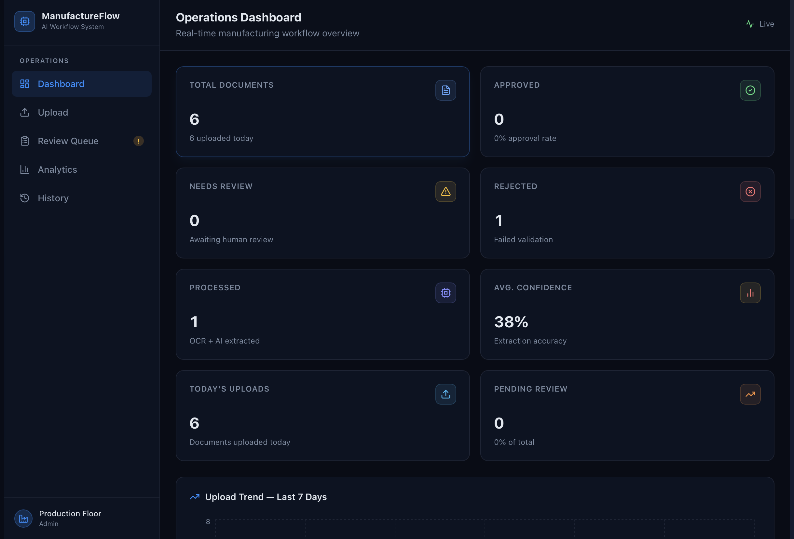
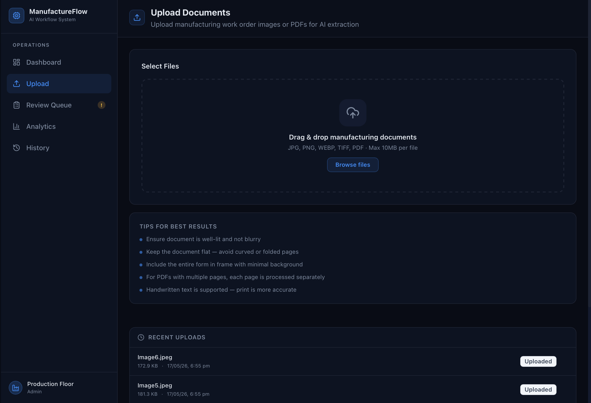
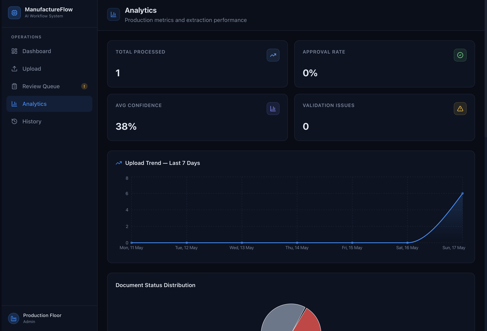

# ManufactureFlow

A production-grade manufacturing operations platform that digitizes handwritten and semi-structured work order documents using OCR + LLM extraction, human-in-the-loop review, business validation, and operational analytics.

## Screenshots







## Features

- **Document Upload** — drag-and-drop, multi-file processing
- **OCR & AI Extraction** — Tesseract.js + LLM (OpenAI/Groq/Anthropic) structured extraction with confidence scoring
- **Human Review & Validation** — editable forms, inline validation, and 20+ modular business rules (format checks, duplicates, range limits)
- **Analytics Dashboard** — KPIs, trends, shift/machine charts, and validation breakdown
- **Audit Trail & History** — immutable event logs and searchable history with CSV export
- **Demo Mode** — runs fully without API keys using heuristic extraction

## Tech Stack

**Next.js 15**, **TypeScript**, **TailwindCSS**, **Prisma** (SQLite/PostgreSQL), **Tesseract.js** (OCR), **OpenAI-compatible APIs**.

## Quick Start

```bash
# 1. Install & configure
npm install
cp .env.example .env.local

# 2. Setup database
npm run db:generate
npm run db:push
npm run db:seed

# 3. Run server
npm run dev
```
## Environment Variables

- `DATABASE_URL` — Prisma connection string (e.g., `file:./dev.db`)
- `AI_PROVIDER` — `openai`, `groq`, `anthropic`, or `openrouter`
- `<PROVIDER>_API_KEY` — API key for the chosen provider (leave blank for Demo Mode)

## Project Structure Highlights

- `app/` — Next.js pages and API routes
- `components/` — UI components (Dashboard, Upload, Review, History)
- `lib/services/` — Core business logic (OCR, LLM Extraction, Validation, Analytics)
- `prisma/` — Database schema and seeding logic

## License

MIT — Built as an MVP for manufacturing workflow automation.
